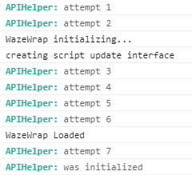

# WME API Helper
## Require Script
```javascript
// @require https://greasyfork.org/scripts/389117-apihelper/code/APIHelper.js?version=XXX
```
> See last available version on the GreasyFork homepage 

## Initialisation of the API Helper
For initial helper use method `APIHelper.bootstrap()`:
```javascript
(function () {
  'use strict';
  APIHelper.bootstrap();
})();
```

This library will **run once** for all scripts!

## Console output



> It works with WazeWrap too!

## Methods
* `APIHelper.bootstrap()` — initialization of the helper, for setup event triggers
* `APIHelper.addStyle(style)` – append CSS style to the page
* `APIHelper.addTranslation(uid, data)` – add translation data to I18n object
* `APIHelper.getVenues(except = [])` – return Array of venues, except some categories
* `APIHelper.getSegments(except = [])` – return Array of segments, except some road types
* `APIHelper.getSelected()` – return Array of the selected **models**, which you can edit
* `APIHelper.getSelectedVenues()` – return Array of the selected venues **models**, which you can edit
* `APIHelper.getSelectedVenue()` – return **model** of the selected venue, which you can edit
* `APIHelper.getSelectedSegments()` – return Array of the selected segments **models**, which you can edit
* `APIHelper.getSelectedSegments()` – return **model** of the selected segment, which you can edit
* `APIHelper.getSelectedNodes()` – return Array of the selected nodes **models**, which you can edit, or null
* `APIHelper.getSelectedNode()` – return **model** of the selected node, which you can edit, or null

## Events
* `init.apihelper` – on `document`, when all ready for usage
* `node.apihelper` – on `document`, when chosen some node for edit
* `segment.apihelper` – on `document`, when chosen some segment for edit
* `landmark.apihelper` – on `document`, when chosen some place for edit
* `landmark-collection.apihelper` – on `document`, when chosen more than one place

## Example

```javascript
(function () {
  'use strict';

  // uniq script name
  const NAME = 'Some Script';
  // translation structure
  const TRANSLATION = {
    'en': {
      title: 'Title example',
    },
    'uk': {
      title: 'Приклад назви',
    },
    'ru': {
      title: 'Пример названия',
    }
  };

  APIHelper.bootstrap();
  APIHelper.addTranslation(NAME, TRANSLATION);
  APIHelper.addStyle(
    '#uniq-id div { background-color: #123; }' +
    ''
  );

  $(document)
      .on('init.apihelper', function () {
        console.info('@ready');
      })
      .on('node.apihelper', (e, el) => {
        console.info('@node', el);
      })
      .on('segment.apihelper', (e, el) => {
        console.info('@segment', el);
      })
      .on('landmark.apihelper', (e, el) => {
        console.info('@landmark', el);
      })
      .on('landmark-collection.apihelper', (e, el) => {
        console.info('@landmark-collection', el)
      });
})();
```

## Links
Author homepage: http://anton.shevchuk.name/  
Script homepage: https://github.com/AntonShevchuk/wme-api-helper  
GreasyFork: https://greasyfork.org/uk/scripts/389117-apihelper  
